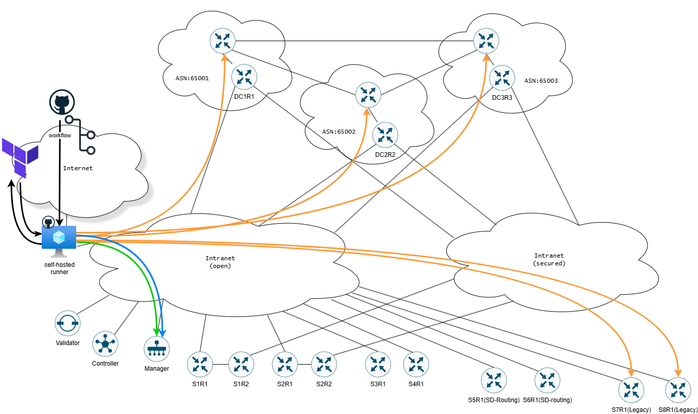

# IaC-SD-WAN_SD-Routing_IOS-XE_deployment
Purpose of this LAB is to demonstrate how the IaC SD-WAN/SD-routing/autonomous routers (IOS-XE) based solution could be build with the use of Terrafrom and Github workflows (pipelines).

For Cisco SD-Routing configuration group, minimum software version is Cisco IOS XE Release 17.13.1a - not in the LAB at the moment.  
Cisco SD-Routing DMVPN (Dynamic Multipoint VPN) is available from version 17.15.x - not in the LAB at the moment.

Networks:
- Internet for Github <-> self-hosted runner communication
- Intranet(open) for management plane and non-encrypted data plane traffic
- Intranet(secured) for encrypted data plane traffic

Design highlights:
- SD-WAN routers: S1R1, S2R2, S3R1 and S4R1 are connected only to the open, non-encrypted intranet network
- SD-WAN routers: S1R2 and S2R2 are connected only to secured, encrypted intranet network, management is done via TLOC extension
- SD-Routing routers: S5R1 and S6R1 are connected only to the open, non-encrypted intranet network
- Legacy routers (no controllers, vanilla IOS-XE): S7R1 and S8R1 are connected only to the open, non-encrypted intranet network
- Data center entrypoint routers: DC1R1, DC2R1 and DC3R1 are connected to both, encrypted and non-encrypted intranet networks
- SD-WAN (green) and SD-Routing (blue) routers are configured through self-hosted runner -> Manager
- Legacy and Data center routers (orange) are configured directly through self-hosted runner

  

Non standard config:
- route leaking on DC cores for Legacy DC cores mgmt interface
- TLOC extension for mgmt interface

Issues:
- for iosxe, provider aliases do not work for an alternative router configuration. Even if provider field is specified, resource is applied/destroyed for all of the devices
- iosxe provider will hang if there are no online routers
- for iosxe provider, I've skipped TF config for mgmt interfaces. There is too much risk that TF will remove that config
- impossible to create a sub interface via sd-wan provider, resource: sdwan_service_lan_vpn_interface_ethernet_feature

<!--- 

-->

Tools:
- Github (repo, workflows, self-hosted runner)
- Terraform cloud (for Terraform state)
- Terraform providers: CiscoDevNet/iosxe v.0.5.10, CiscoDevNet/sdwan v.0.6.1
- draw.io
- Cisco SD-WAN on-premise (Manager, Validator, Controller: v.20.12.4)
- Cisco C8000v v.17.12.04b
- Eve-NG Community
- VMWare Workstation 17.6.2
