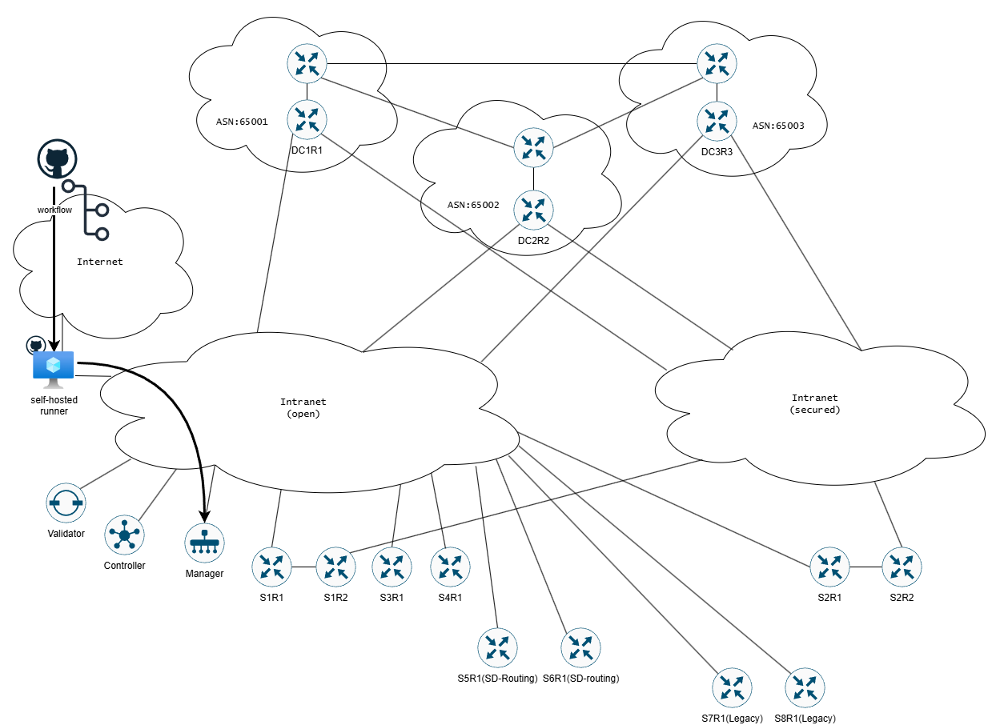

# IaC-SDWAN-deployment
Purpose of this LAB is to demonstrate how the IaC SDWAN solution could be build with the use of Terrafrom and Github workflows (pipelines).

Networks:
- Internet for Github <-> self-hosted runner communication
- Intranet(open) for management plane and non-encrypted data plane traffic
- Intranet(secured) for encrypted data plane traffic

SD-WAN routers: S1R1, S2R2, S3R1 and S4R1 are connected only to the open, non-encrypted intranet  
SD-WAN routers: S1R2 and S2R2 are connected only to secured, encrypted intranet, management is done via TLOC extension  
SD-Routing routers: S5R1 and S6R1 are connected only to the open, non-encrypted intranet  
Legacy routers: S7R1 and S8R1 are connected only to the open, non-encrypted intranet  
Data center entrypoint routers: DC1R1, DC2R1 and DC3R1 are connected to both, encrypted and non-encrtypted intranet networks  

  
  
<!--- 

-->

Tools:
- Github (repo, workflows, self-hosted runner)
- Terraform
- draw.io

