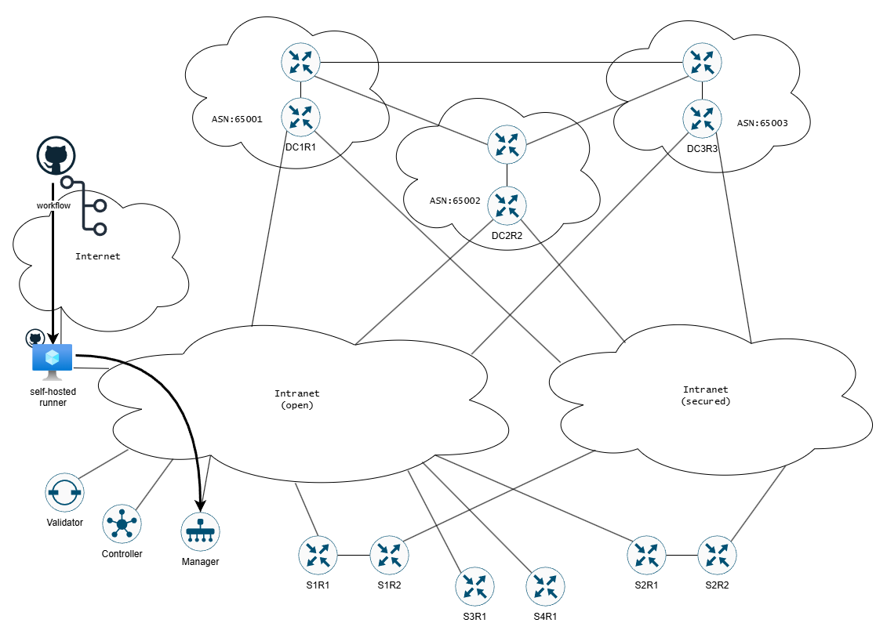

# IaC-SDWAN-deployment
Purpose of this LAB is to demonstrate how the IaC SDWAN solution could be build with the use of Terrafrom and Github workflows (pipelines).

Networks:
- Internet for Github <-> self-hosted runner communication
- Intranet(open) for management plane and not encrypted data plane traffic
- Intranet(secured) for encrypted data plane traffic

  
  
<!--- 

-->

Tools:
- Github (repo, workflows, self-hosted runner)
- Terraform
- draw.io

