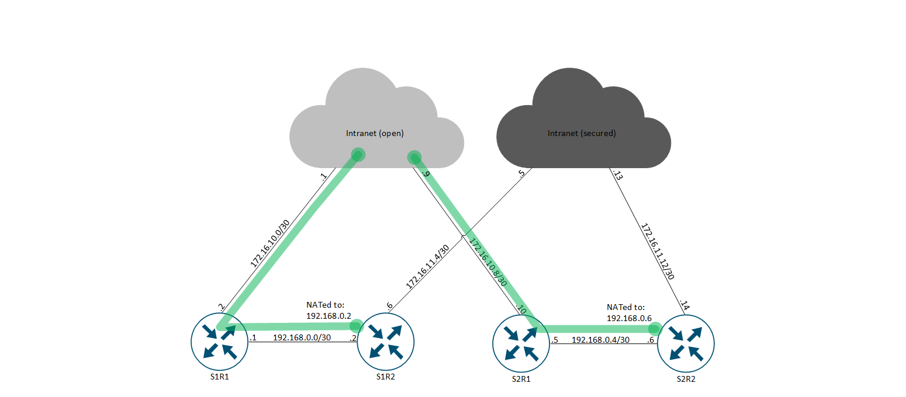

# IaC-SD-WAN_SD-Routing_IOS-XE_deployment
Purpose of this LAB is to demonstrate how to use Infrastructure as Code aproach to build configs for below services, with the use of Terrafrom and Github workflows (pipelines):
- SD-WAN
- SD-routing
- autonomous routers (IOS-XE)  

For Cisco SD-Routing configuration group, minimum software version is Cisco IOS XE Release 17.13.1a - not in the LAB at the moment.  
Cisco SD-Routing DMVPN (Dynamic Multipoint VPN) is available from version 17.15.x - not in the LAB at the moment.  

<br/>

Network types:
- Internet for Github <-> self-hosted runner communication
- Intranet(open) for management plane and non-encrypted data plane traffic
- Intranet(secured) for encrypted data plane traffic  

<br/>

Design highlights:
- SD-WAN routers: S1R1, S2R2, S3R1 and S4R1 are connected only to the open, non-encrypted intranet network
- SD-WAN routers: S1R2 and S2R2 are connected only to secured, encrypted intranet network, management is done via TLOC extension
- SD-Routing routers: S5R1 and S6R1 are connected only to the open, non-encrypted intranet network
- Legacy routers (no controllers, vanilla IOS-XE): S7R1 and S8R1 are connected only to the open, non-encrypted intranet network
- Data center entrypoint routers: DC1R1, DC2R1 and DC3R1 are connected to both, encrypted and non-encrypted intranet networks
- SD-WAN (green) and SD-Routing (blue) routers are configured through self-hosted runner -> Manager
- Legacy and Data center routers (orange) are configured directly through self-hosted runner

<br/>

> [!NOTE]
> For better design understanding, please analyse below drawings, or even better - call me :relaxed:

<br/>

  
*Network: management plane - general design*

<br/>

Below drawing presents TLOC-extension mechanism as management access to routers which are not connected directly to the Intranet (open) cloud.

  
*Network: Management plane - TLOC-extension*

  
*Network: ASN and IP plan*

  
*Network: Control plane*

  
*Network: Management and data plane VRFs*

  
*Network: Data plane (Intranet)*

<br/>

Non standard config:
- route leaking on DC cores for Legacy DC cores mgmt interface
- TLOC extension for mgmt interface
- TF legacy routers iosxe provider and separate provider for legacy core devices (deployed as list of devices)

<br/>

> [!CAUTION]
> - iosxe provider will hang if there are no online routers
> - for iosxe provider, I've skipped TF config for mgmt interfaces. There is too much risk that TF will remove that config
> - impossible to create a sub interface via sd-wan provider, resource: *sdwan_service_lan_vpn_interface_ethernet_feature*
> - if you want to shutdown interface based on a resource: *sdwan_transport_wan_vpn_interface_ethernet_feature* or *sdwan_service_lan_vpn_interface_ethernet_feature*, then you need to first assigned IP address and/or nat type ...  
```terraform
resource "sdwan_transport_wan_vpn_interface_ethernet_feature" "edge_dual1_vpn0_if_eth2_v01" {
  name                         = "WAN_VPN0_IF_ETH_v02"
  feature_profile_id           = sdwan_transport_feature_profile.edge_transport_v01.id
  transport_wan_vpn_feature_id = sdwan_transport_wan_vpn_feature.transport_wan_vpn_v01.id
  interface_name               = "GigabitEthernet2"
  shutdown                     = true
  interface_description        = "NOT-USED"
  ipv4_configuration_type      = "static"
  ipv4_address                 = "1.1.1.1"
  ipv4_subnet_mask             = "255.255.255.254"
}
```
Better alternative is to use CLI template:
```terraform
resource "sdwan_cli_config_feature" "edge_cli_cfg_v01" {
  feature_profile_id = sdwan_cli_feature_profile.edge_cli_v01.id
  name               = "EDGE_CLI_CFG_v01"
  description        = "EDGE CLI config"
  cli_configuration  = <<-EOT
  interface GigabitEthernet2
  shutdown
  !
  EOT
}
```


<!--- 

-->
<br/>

Tools:
- Github (repo, workflows, self-hosted runner)
- Terraform cloud (for Terraform state)
- Terraform providers: CiscoDevNet/iosxe v.0.5.10, CiscoDevNet/sdwan v.0.6.1
- Cisco SD-WAN on-premise (Manager, Validator, Controller: v.20.12.4)
- Cisco C8000v v.17.12.04b
- Eve-NG Community
- VMWare Workstation 17.6.2
- draw.io
- Visio
